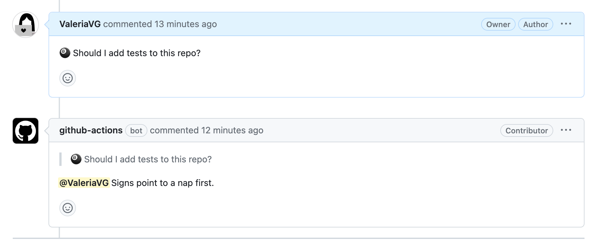
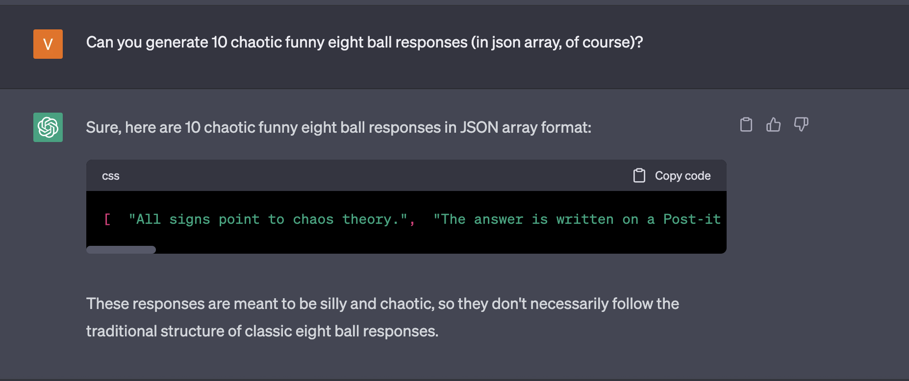

# GitHub Actions: Magic Eight Ball comments

Get Magic ball answers delivered directly to your comments.

## How to use
Create an action in `.github/workflows`:
```yml
on:
  issue_comment:
    types: [created]
jobs:
  example_comment_pr:
    runs-on: ubuntu-latest
    name: Magic Eight Ball Comments
    permissions:
        pull-requests: write
        issues: write
    steps:
      - name: Answer
        uses: ValeriaVG/actions-magic-8-ball@v1
```

Post a comment in PR or and issue starting with "🎱" and get a prediction:



### With custom prefix

You can also change the prefix to a custom one:

```yml
on:
  issue_comment:
    types: [created]
jobs:
  example_comment_pr:
    runs-on: ubuntu-latest
    name: Magic Eight Ball Comments
    permissions:
        pull-requests: write
        issues: write
    steps:
      - name: Answer
        uses: ValeriaVG/actions-magic-8-ball@v1
        with:
          prefix: 'Magic ball, would you please'
```

## Credits

Responses have been generated with [Free Research Preview ChatGPT](https://chat.openai.com/)

